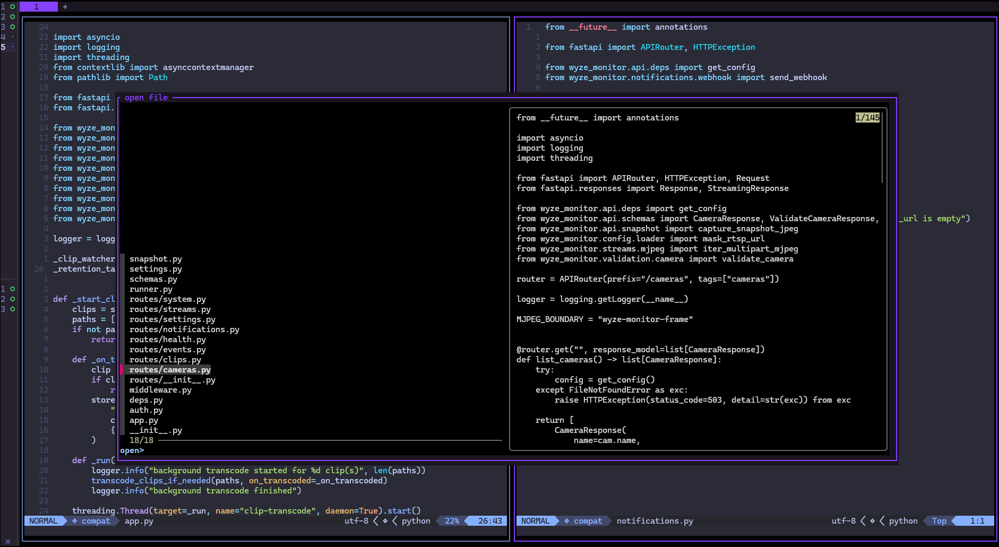
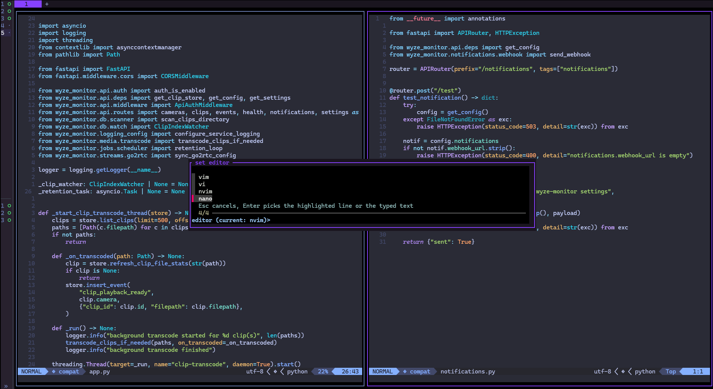

# herdr-open-editor

  



**Fuzzy-pick a file, open it in whatever editor you actually use.** One key opens an [fzf](https://github.com/junegunn/fzf) popup over your repo (or cwd); `Enter` hands the pick to a real split pane running your configured `$EDITOR` - no hardcoded editor, no config file to hand-edit if you don't want to.

## Quick start

```bash
herdr plugin install jimididit/herdr-open-editor
```

Add keybindings to `~/.config/herdr/config.toml`:

```toml
[[keys.command]]
key = "prefix+ctrl+e"
type = "plugin_action"
command = "jdi.open-editor.pick"
description = "open file"

[[keys.command]]
key = "prefix+ctrl+u"
type = "plugin_action"
command = "jdi.open-editor.set-editor"
description = "set editor"
```

Run `herdr server reload-config`, then press `prefix` `ctrl+e` in any pane.

## Usage

### Pick a file - `prefix` -> `ctrl+e`

Popup opens; fuzzy-search git-tracked files (or cwd, dotfiles excluded, outside a repo). `?` toggles the preview panel. `Enter` opens the pick in a new split pane running your editor - the popup itself never hosts the edit, since it's a transient modal, not a real tiled pane. `Esc` cancels.

### Set editor - `prefix` -> `ctrl+u`



Popup lists every editor it finds on `PATH` (checks `nvim`, `vim`, `vi`, `nano`, `micro`, `emacs`, `hx`, `kak`, `joe`, `ne`, `code`, `subl`, `zed`, `zeditor`). Pick one, or type a name not in the list and hit `Enter` to use it anyway. `Esc` cancels without changing anything.

Editor precedence: whatever `set-editor` last saved -> `$EDITOR` -> `vi`. GUI editors need a flag that blocks until the file is closed to work as a terminal `$EDITOR` - the built-in list already accounts for that (`code --wait`, `subl --wait`, `zed --wait`).

Stored at `~/.config/herdr/plugins/config/jdi.open-editor/config.env` - plain `OPEN_EDITOR=...`, editable by hand too.

## Requirements

`fzf` · `jq` · herdr 0.7.4+ · Linux/macOS. `bat` is optional (nicer preview syntax highlighting; falls back to `cat`).

## Development

```bash
herdr plugin link /path/to/herdr-open-editor
herdr plugin action invoke jdi.open-editor.pick
herdr plugin log --plugin jdi.open-editor    # inspect recent invocations
```

### Structure

- `herdr-plugin.toml` - two workspace actions (`pick`, `set-editor`), each opening its own popup pane
- `bin/lib.sh` - shared config-file path + editor loader
- `bin/pick.sh` - the file picker; opens a real split pane for the edit
- `bin/set-editor.sh` - the editor-selection popup
